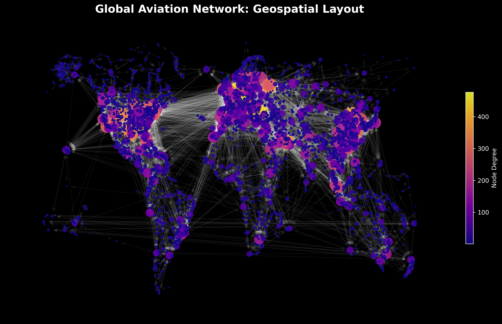
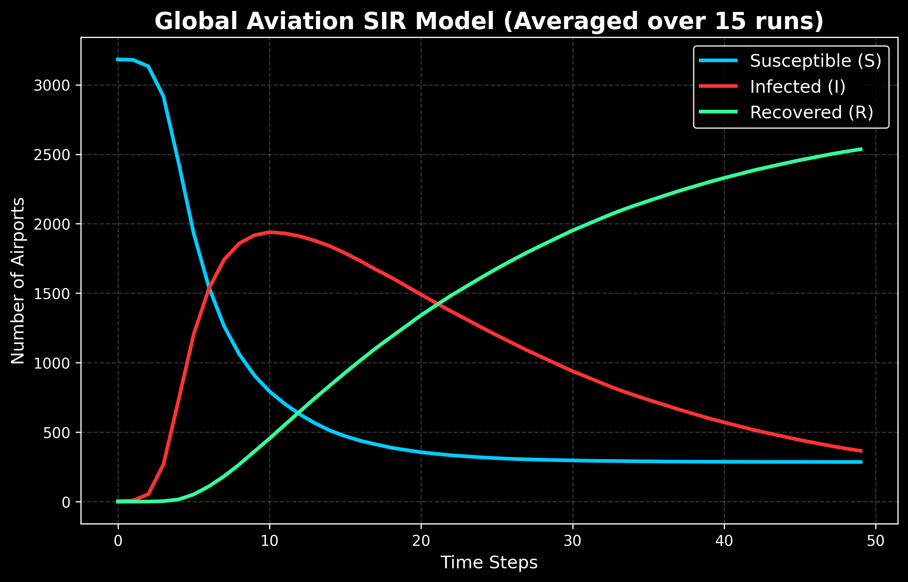
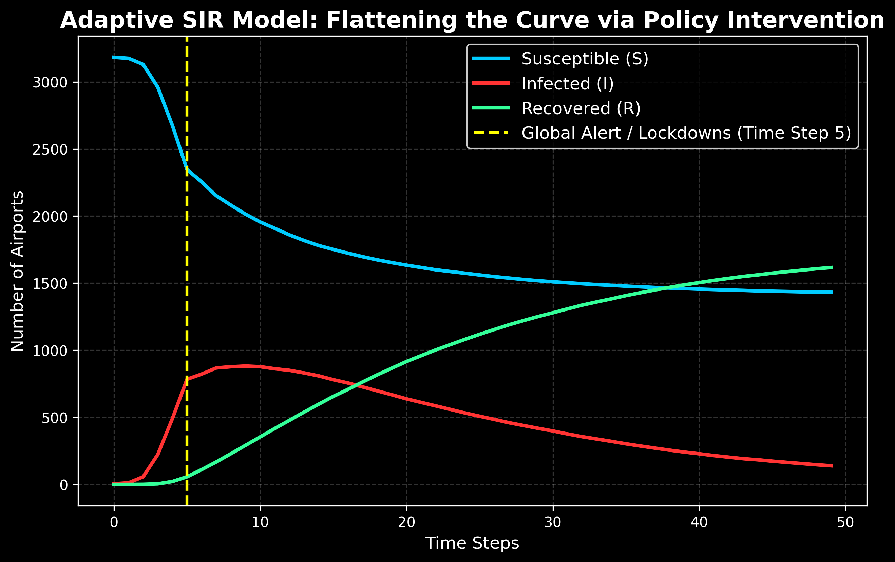
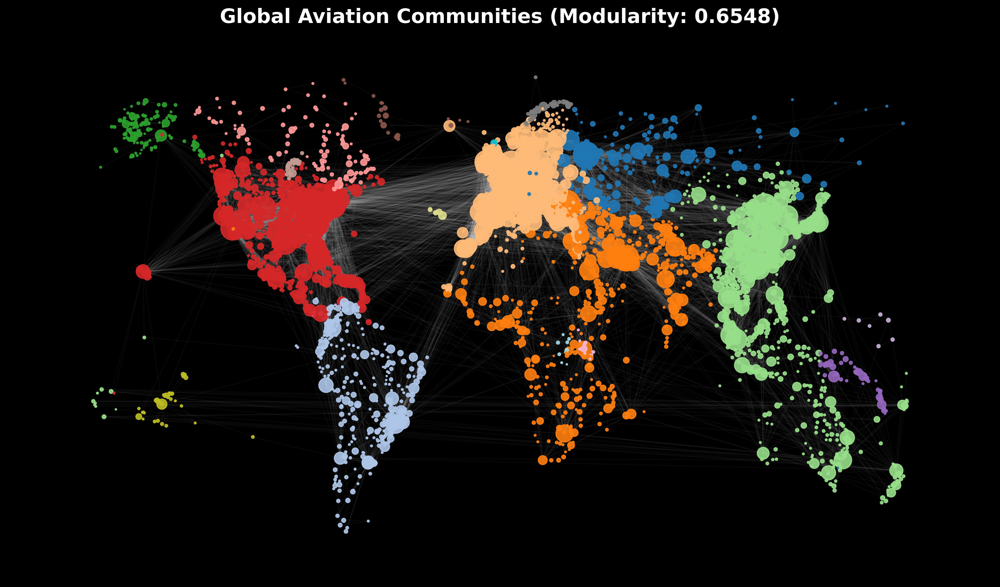
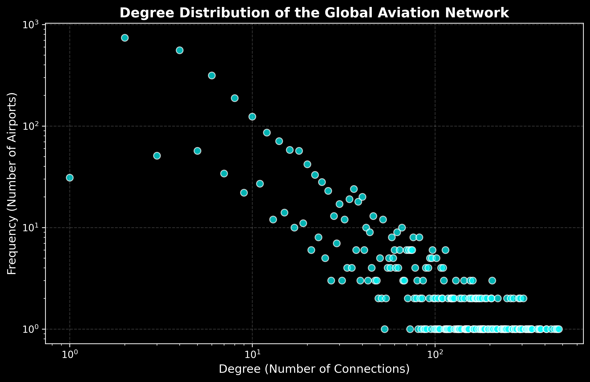
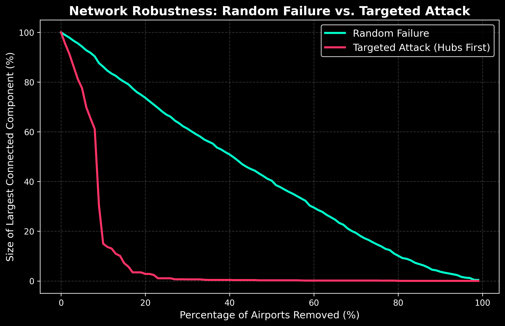
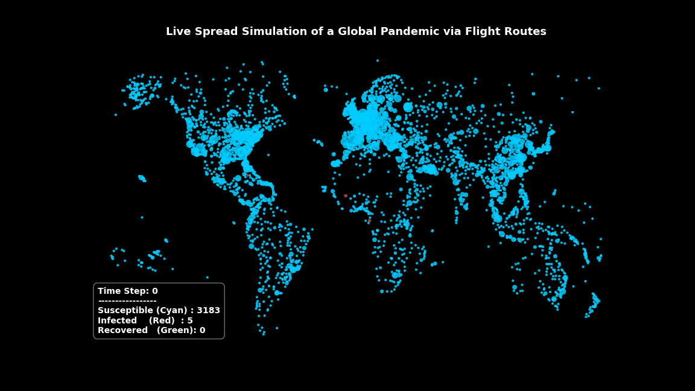

# ✈️ Global Aviation Network Resilience & Pandemic Dynamics


> 🎓 **Social Networks Course Project** — An empirical network science and data visualization pipeline built as the final project for the Social Networks course. This project models the global aviation infrastructure (3,188 airports, 36,860 routes) to analyze structural vulnerabilities, detect geopolitical communities, and simulate pandemic spreading dynamics under adaptive global lock-down policies.

---

## 📌 Project Overview

This project treats the global aviation network as a complex directed graph. By integrating graph theory, percolation physics, and epidemiological modeling, the pipeline provides actionable insights into how structural design dictates both economic robustness and global pandemic vulnerability.

---

## 🎨 Preview & Visual Showcase

### 🗺️ Global Flight Trajectories (Geospatial Mapping)


### 🦠 Spreading Dynamics Comparison
| Standard SIR Model (No Intervention) | Adaptive SIR Model (Flattening the Curve) |
| :---: | :---: |
|  |  |

### 🎨 Louvain Geopolitical Partitioning & Scale-Free Proof
| Community Detection (Louvain) | Log-Log Degree Distribution |
| :---: | :---: |
|  |  |

### 🛡️ Targeted Attack Resiliency (Percolation Curves)


### 🎬 Live Contagion Propagation (Spreading Animation)


---

## 🚀 Key Features

### 🔍 1. Topological Profiling
* **Small-World Dynamics:** Proves the "six degrees of separation" in physical transit, showing a short Network Diameter (Diameter = 12) paired with high local clustering (~0.49).
* **Scale-Free Architecture:** Leverages log-log cumulative degree distribution plots to mathematically prove the power-law degree distribution characteristic of preferential attachment networks.

### 🛡️ 2. Percolation & Robustness Simulations
* **Random Failures:** Simulates system recovery under random node failures.
* **Targeted Attack Resiliency:** Models systematic network collapse under coordinated attacks targeting high-degree hubs, revealing a critical percolation threshold.

### 🎨 3. Geospatial Community Detection
* **Unsupervised Partitioning:** Runs the Louvain Modularity algorithm to group airports into 20 highly distinct geographical communities.

### 🦠 4. Adaptive Spreading Dynamics
* **The Zero-Threshold Dilemma:** Illustrates why pandemics spread instantly in Scale-Free networks due to an epidemic threshold approaching zero.
* **Policy Interventions:** Demonstrates the mathematical efficacy of timely flight bans.

---

## 🛠️ Installation & Tech Stack

```bash
# Clone the repository
git clone [https://github.com/yourusername/global-aviation-network-resilience.git](https://github.com/yourusername/global-aviation-network-resilience.git)

# Install dependencies
pip install networkx pandas matplotlib numpy python-louvain pillow

# Launch the analysis pipeline
jupyter notebook Global_Aviation_Network.ipynb

📂 Repository Structure
├── README.md                     
├── Global_Aviation_Network.ipynb 
├── data/                         
│   ├── airports.dat
│   └── routes.dat
└── visualizations/               
    ├── adaptive_sir_simulation.png
    ├── community_detection.png
    ├── degree_distribution.png
    ├── geospatial_network.png
    ├── live_epidemic_spread.gif
    ├── robustness_curves.png
    └── sir_simulation.png

🎓 References

Barabási, A.-L. (2016). Network Science. Cambridge University Press. Online version at networksciencebook.com.

OpenFlights Airport and Route Database: openflights.org/data.

Developed with ❤️ by Mahmoud Abdel Nasser